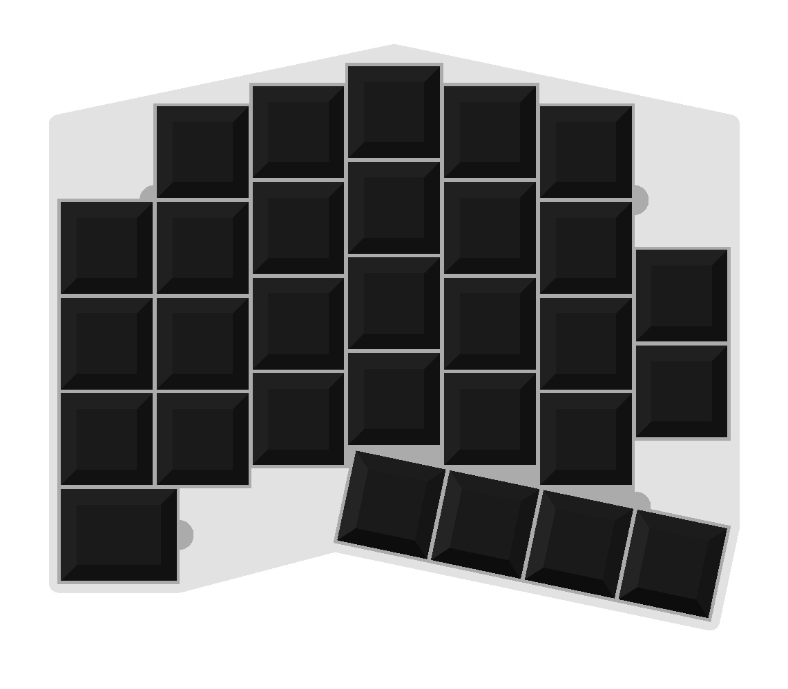

# mkb

This repository holds designs and libs for 3D-printed and handwired keyboards.

## Exporting

To export a 3D-model, you'll need [OpenSCAD](https://www.openscad.org/).

Open the .scad file you wish to export models from.

You can edit the parameters at the top of the file to customize the design to your liking.

Render with F6 and export with F7.

## 3D-printing

All designs can be printed without supports and the recommended layer height is 0.25mm. Other layer heights may introduce rounding errors which can cause the switches to not snap in properly.
